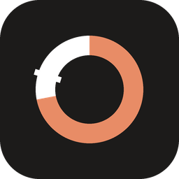
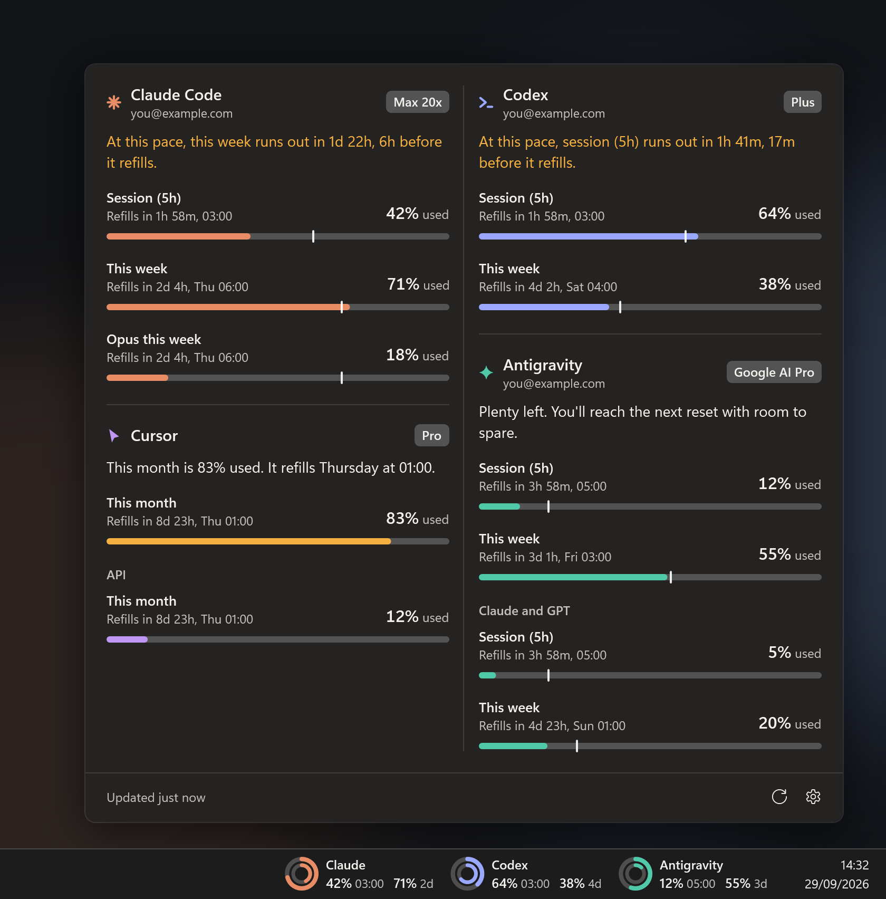

<div align="center">



# TokenTray

**Claude Code, Codex, Gemini (Antigravity), Cursor, Grok and OpenCode usage limits — live in the Windows taskbar.**

See your 5-hour session and weekly limits next to the clock, know exactly when they reset,
and get a heads-up before you run out. No browser tab, no `/usage` command, no telemetry.

[](#install)
[](https://dotnet.microsoft.com/)
[](https://github.com/emrecengdev/tokentray/releases/latest)
[](LICENSE)

[**Download**](https://github.com/emrecengdev/tokentray/releases/latest) · [Features](#features) · [Supported tools](#supported-tools) · [FAQ](#faq) · [Türkçe](README.tr.md)



</div>

## Why TokenTray?

AI coding plans meter you in windows: a five-hour session, a weekly allowance, sometimes a monthly pool.
Hitting one mid-task is the worst time to find out. TokenTray keeps every limit you have in view,
tells you when each one refills, and warns you while there's still time to change pace.

<div align="center">

</div>

## Features

- **Lives in the taskbar.** A widget next to the clock shows each tool's session and weekly usage, with the reset beside every number: `04:00` when it's today, `3d` when it's days away.
- **One sentence per tool.** The panel tells you what the numbers mean — *"Plenty left"*, *"87% used, but this pace lasts until 04:00"*, or *"At this pace, this week runs out in 6h, 2h before it refills"*.
- **Pace notch.** Every bar carries a notch for how much of the window has passed. Stay behind it and you'll make it to the reset.
- **Five widget styles, two variants each.** Rings, Dots, Cells, Bars and Simple — with the tool's name or a compact icon. Pick what's on it: session, weekly, reset time.
- **Hover for details.** A glance card lists every window with its exact reset time.
- **Warnings that don't nag.** A notification at 20% and 5% left and when a limit refills — once per cycle.
- **Several accounts.** Add another Claude Code or Codex config folder; each account keeps its own numbers.
- **Light, dark or follow Windows.** Acrylic panel on Windows 11, solid on Windows 10. English and Turkish.
- **Well-behaved.** Remembers the last reading across restarts, shows old numbers dimmed instead of blanking out, respects every `Retry-After`, and steps aside if the taskbar gets crowded.

<div align="center">

</div>

## Supported tools

| Tool | What you see | Where it reads from (read-only) |
| --- | --- | --- |
| **Claude Code** (Pro, Max 5x, Max 20x) | 5-hour session, weekly, per-model weekly (e.g. Opus) | Claude Code CLI sign-in (`~/.claude/.credentials.json`), or the Claude desktop app's own sign-in when the CLI's has expired — only if it's the same account |
| **Codex** (ChatGPT Plus, Pro) | 5-hour session (where your plan has one), weekly | Codex CLI sign-in (`~/.codex/auth.json`, `CODEX_HOME`) |
| **Google Antigravity** (Gemini) | 5-hour and weekly for Gemini models, plus the Claude & GPT pool | Antigravity's sign-in in Windows Credential Manager |
| **Grok Build** | Weekly or monthly credit pool | Grok CLI sign-in (`~/.grok/auth.json`) |
| **Cursor** | Included usage this billing month, API usage | Cursor's local session (`state.vscdb`) or `CURSOR_SESSION_TOKEN` |
| **OpenCode Go** | 5-hour, weekly, monthly | A workspace id and session cookie you provide |

Tools found on your PC are turned on automatically. Anything else can be switched on in **Settings → General**.

## Install

1. Download the zip for your PC from the [latest release](https://github.com/emrecengdev/tokentray/releases/latest):
   - `TokenTray-…-win-x64.zip` — most PCs. Single file, nothing else to install.
   - `TokenTray-…-win-arm64.zip` — Snapdragon and other ARM laptops.
   - `TokenTray-…-win-x64-small.zip` — 6 MB, needs the [.NET 10 Desktop Runtime](https://dotnet.microsoft.com/download/dotnet/10.0).
2. Unzip anywhere and run `TokenTray.exe`. The panel opens once to show what it found.
3. Optional: **Settings → General → Start with Windows**.

> The executable isn't code-signed yet, so Windows SmartScreen may warn the first time: choose **More info → Run anyway**. Checksums are in `SHA256SUMS.txt` on every release.

**Requirements:** Windows 10 1809 or later, or Windows 11 (x64 or ARM64), and a signed-in tool from the list above.

## Using it

| Do this | To |
| --- | --- |
| Hover the widget | See every window with its exact reset time |
| Click the widget or tray icon | Open the panel |
| Right-click | Refresh now, Settings, Quit |
| Settings → Taskbar | Pick a style and variant, choose what the widget shows, nudge its position |
| Settings → General | Turn tools on or off, add accounts, show *used* or *left*, theme, notifications, check interval |

If Windows 11 hides the tray icon under `^`, drag it onto the taskbar to keep it visible.

## Privacy and security

- **Read-only.** TokenTray never refreshes tokens and never writes to any tool's files. When a sign-in expires, open the tool once and it renews itself.
- **Direct to the source.** Requests go only to each tool's own usage endpoint. There is no TokenTray server.
- **No telemetry.** Nothing about you or your usage leaves your PC except those requests.
- **Local storage:** settings in `%APPDATA%\TokenTray`, the last reading and notification history in `%LOCALAPPDATA%\TokenTray`. Delete them any time.
- The Claude desktop app's sign-in is encrypted for your Windows user; TokenTray decrypts it with Windows DPAPI, the same way the app does, and only uses it if it matches the CLI's account.

Found a security issue? See [SECURITY.md](SECURITY.md).

## FAQ

<details>
<summary><b>How do I see my Claude Code usage limit on Windows?</b></summary>

Sign in to Claude Code (`claude`) or the Claude desktop app, then run TokenTray. Your 5-hour session and weekly limits appear next to the clock — the same numbers Claude shows under *Settings → Usage*.
</details>

<details>
<summary><b>Does it show the Codex 5-hour limit?</b></summary>

Yes, when your ChatGPT plan has one. TokenTray shows exactly the windows the Codex service reports for your account; if there's only a weekly limit, that's all it shows — no empty placeholders.
</details>

<details>
<summary><b>It says "sign-in expired". What now?</b></summary>

Open the tool once — run `claude`, `codex` or `grok`, or open Antigravity or Cursor — and it renews its own sign-in. TokenTray keeps showing your last reading, dimmed, until then.
</details>

<details>
<summary><b>Why is the shortest check interval two minutes?</b></summary>

Claude's usage endpoint answers frequent requests with *429 Too Many Requests*. Two minutes keeps you well inside that, and TokenTray always waits out a `Retry-After`, even across restarts and manual refreshes.
</details>

<details>
<summary><b>Can I show what's left instead of what's used?</b></summary>

Yes: **Settings → General → Numbers show → Left**. The default is *Used*, matching how Claude and Codex report it.
</details>

<details>
<summary><b>Does it work with a vertical or auto-hiding taskbar, or several monitors?</b></summary>

The widget sits on a horizontal taskbar of the main monitor and follows auto-hide. With a vertical taskbar, the tray icon and panel still work.
</details>

<details>
<summary><b>Is this made by Anthropic, OpenAI, Google, xAI or Cursor?</b></summary>

No. TokenTray is an independent open-source project and isn't affiliated with or endorsed by any of them. It reads the same usage information the official tools show you.
</details>

## Build from source

```powershell
git clone https://github.com/emrecengdev/tokentray
cd tokentray
dotnet test                          # 50 unit tests
dotnet run --project src/TokenTray   # run it
.\publish.ps1 -Version 1.1.0         # release zips + SHA256SUMS in .\dist
```

Needs the [.NET 10 SDK](https://dotnet.microsoft.com/download/dotnet/10.0). The README images are drawn by the app itself from sample data: `TokenTray.exe --render-media docs\media`, then `python tools\make_hero.py`.

**Layout:** `src/TokenTray.Core` holds the providers, polling, pace and cache logic (no UI, fully tested); `src/TokenTray` is the WPF app — taskbar widget, panel, hover card, tray icon.

## Contributing

Issues and pull requests are welcome — especially reports from tools, plans and Windows setups we can't test ourselves. See [CONTRIBUTING.md](CONTRIBUTING.md).

## License

[MIT](LICENSE). Product names and marks belong to their owners; the tool icons in TokenTray are simple geometric marks, not their logos.

Inspired by [CodeZeno/Claude-Code-Usage-Monitor](https://github.com/CodeZeno/Claude-Code-Usage-Monitor).
