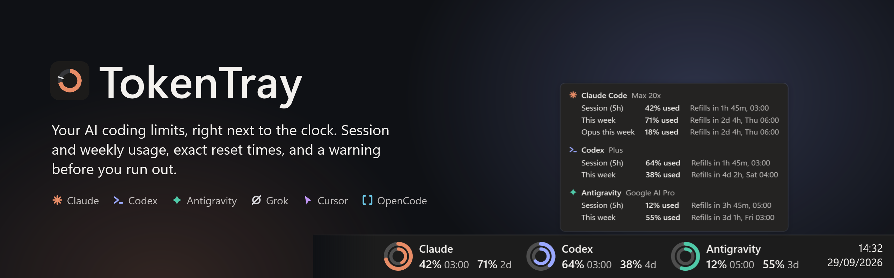
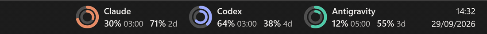
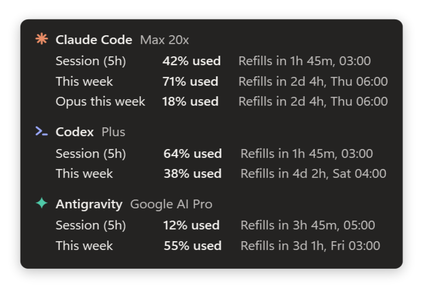
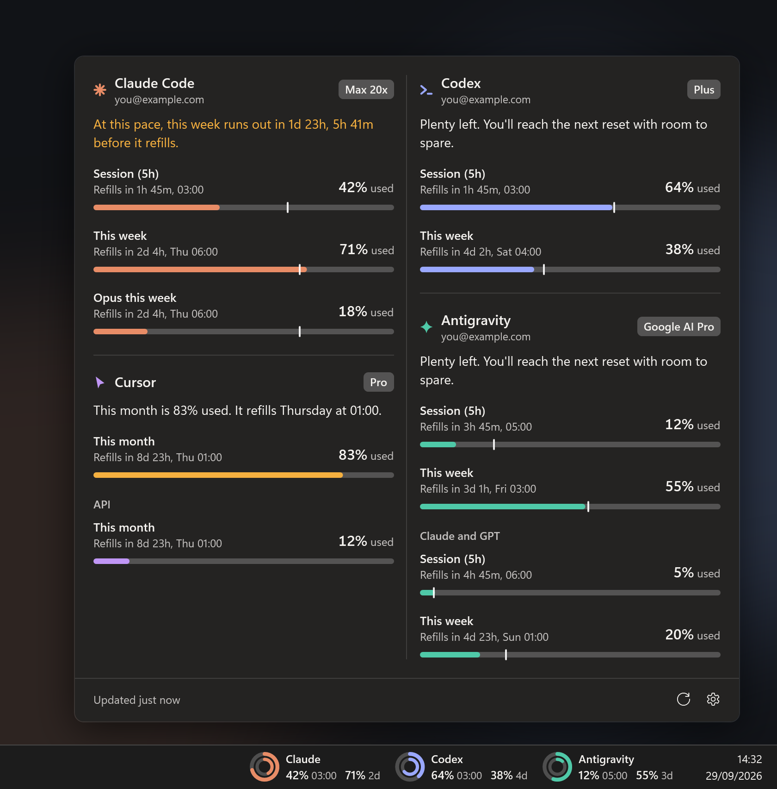
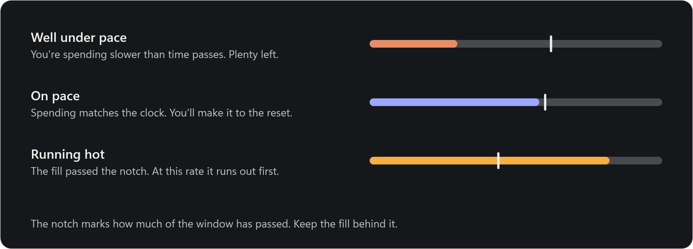
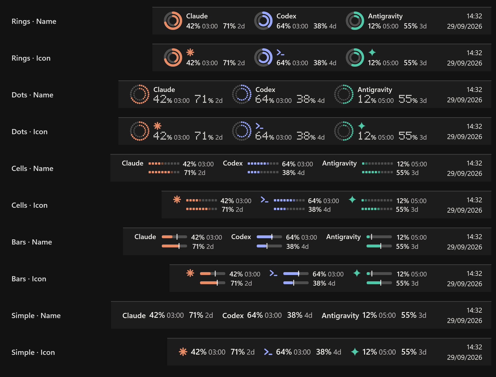
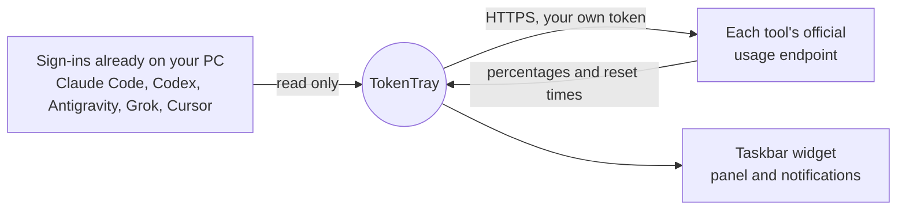

<picture>
  <source media="(prefers-color-scheme: dark)" srcset="docs/media/banner-dark.png">
  <source media="(prefers-color-scheme: light)" srcset="docs/media/banner-light.png">
  
</picture>

<div align="center">

[](https://github.com/emrecengdev/tokentray/releases/latest)
[](#quick-start)
[](https://github.com/emrecengdev/tokentray/actions/workflows/ci.yml)
[](LICENSE)

**A Claude Code usage monitor for Windows — and Codex, Gemini (Antigravity), Grok, Cursor and OpenCode too.**<br>
Your 5-hour session and weekly limits live next to the clock, with the exact time each one refills<br>
and a heads-up before you run out. No browser tab, no `/usage` command, no telemetry.

[**Download for Windows**](https://github.com/emrecengdev/tokentray/releases/latest) &nbsp;·&nbsp; [Quick start](#quick-start) &nbsp;·&nbsp; [Supported tools](#supported-tools) &nbsp;·&nbsp; [FAQ](#faq) &nbsp;·&nbsp; [Türkçe](README.tr.md)


</div>

<br>

## See it at a glance

Every tool you use gets a spot on the taskbar: session and weekly usage side by side, each number
with its own reset — `03:00` when it's today, `2d` when it's days away. Colors only change when
something needs your attention.

<p align="center">

</p>

## Hover for the details

Rest the pointer on the widget and a card lists every limit with the exact time it refills.
No clicking, no focus stolen.

<p align="center">
<picture>
  <source media="(prefers-color-scheme: dark)" srcset="docs/media/hover-dark.png">
  <source media="(prefers-color-scheme: light)" srcset="docs/media/hover-light.png">
  
</picture>
</p>

## Click for the whole picture

The panel reads your numbers back to you in one sentence per tool — *plenty left*,
*87% used but this pace lasts until 04:00*, or *at this pace it runs out 2 hours before it refills* —
then lays out every window, plan and account. With three or more tools it opens into two columns.

<p align="center">
<picture>
  <source media="(prefers-color-scheme: dark)" srcset="docs/media/hero-dark.png">
  <source media="(prefers-color-scheme: light)" srcset="docs/media/hero-light.png">
  
</picture>
</p>

## The pace notch

Percentages tell you where you are. The notch tells you whether you'll make it. Every bar carries a
mark for how much of its window has already passed; stay behind it and your allowance lasts until the reset.

<p align="center">
<picture>
  <source media="(prefers-color-scheme: dark)" srcset="docs/media/pace-dark.png">
  <source media="(prefers-color-scheme: light)" srcset="docs/media/pace-light.png">
  
</picture>
</p>

## Make it yours

Five taskbar styles — **Rings, Dots, Cells, Bars, Simple** — each with the tool's name or a compact icon.
Choose what it shows (session, weekly, reset time), used or left, and a light, dark or system theme.
Settings preview every option with your own numbers before you pick.

<p align="center">

</p>

<details>
<summary><b>Everything else it does</b></summary>
<br>

- **Warnings that don't nag:** a notification at 20% and 5% left and when a limit refills, once per cycle.
- **Several accounts:** add another Claude Code or Codex config folder; each account keeps its own numbers and notifications.
- **Plans at a glance:** Max 5x / 20x, Pro, Plus, Google AI Pro / Ultra — straight from your sign-in.
- **Never blank:** the last reading survives restarts; if a sign-in expires or the network drops, numbers stay visible, dimmed, with an amber dot.
- **Polite to the services:** every `Retry-After` is honored, across restarts and manual refreshes.
- **Knows its place:** if taskbar buttons need the room, the widget turns compact, then steps aside; the tray icon stays.
- **Native feel:** acrylic panel on Windows 11, per-monitor DPI, respects reduced motion, keyboard-friendly panel, English and Turkish.

</details>

## Supported tools

| | Tool | Limits shown | Signed in via |
| :-: | --- | --- | --- |
| <picture><source media="(prefers-color-scheme: dark)" srcset="docs/media/mark-claude-dark.png"><source media="(prefers-color-scheme: light)" srcset="docs/media/mark-claude-light.png"></picture> | **Claude Code** — Pro, Max 5x, Max 20x | 5-hour session, weekly, per-model weekly (e.g. Opus) | Claude Code CLI, or the Claude desktop app (same account only) |
| <picture><source media="(prefers-color-scheme: dark)" srcset="docs/media/mark-codex-dark.png"><source media="(prefers-color-scheme: light)" srcset="docs/media/mark-codex-light.png"></picture> | **Codex** — ChatGPT Plus, Pro | 5-hour session where your plan has one, weekly | Codex CLI |
| <picture><source media="(prefers-color-scheme: dark)" srcset="docs/media/mark-antigravity-dark.png"><source media="(prefers-color-scheme: light)" srcset="docs/media/mark-antigravity-light.png"></picture> | **Google Antigravity** (Gemini) | 5-hour and weekly for Gemini models, plus the Claude & GPT pool | Antigravity |
| <picture><source media="(prefers-color-scheme: dark)" srcset="docs/media/mark-grok-dark.png"><source media="(prefers-color-scheme: light)" srcset="docs/media/mark-grok-light.png"></picture> | **Grok Build** | Weekly or monthly credit pool | Grok CLI |
| <picture><source media="(prefers-color-scheme: dark)" srcset="docs/media/mark-cursor-dark.png"><source media="(prefers-color-scheme: light)" srcset="docs/media/mark-cursor-light.png"></picture> | **Cursor** | Included usage this billing month, API usage | Cursor |
| <picture><source media="(prefers-color-scheme: dark)" srcset="docs/media/mark-opencode-dark.png"><source media="(prefers-color-scheme: light)" srcset="docs/media/mark-opencode-light.png"></picture> | **OpenCode Go** | 5-hour, weekly, monthly | A workspace id and session cookie you provide |

Tools found on your PC switch on by themselves; the rest are one toggle away in **Settings → General**.

## Quick start

1. **Download** the zip for your PC from the [latest release](https://github.com/emrecengdev/tokentray/releases/latest).
2. **Unzip** it anywhere and run `TokenTray.exe`. The panel opens once to show what it found.
3. **Optional:** Settings → General → *Start with Windows*.

| Download | For | Size |
| --- | --- | --- |
| `TokenTray-…-win-x64.zip` | Most PCs. Single file, nothing else to install. | ~70 MB |
| `TokenTray-…-win-arm64.zip` | Snapdragon and other ARM laptops. | ~70 MB |
| `TokenTray-…-win-x64-small.zip` | PCs with the [.NET 10 Desktop Runtime](https://dotnet.microsoft.com/download/dotnet/10.0). | 6 MB |

> [!NOTE]
> TokenTray isn't code-signed yet, so SmartScreen may ask the first time: **More info → Run anyway**.
> Each release ships `SHA256SUMS.txt` so you can check what you downloaded.

**Requirements:** Windows 10 (1809+) or Windows 11, x64 or ARM64, and at least one signed-in tool from the list above.

| Do this | To |
| --- | --- |
| Hover the widget | See every limit with its exact reset time |
| Click the widget or tray icon | Open the panel |
| Right-click | Refresh now · Settings · Quit |
| Settings → Taskbar | Pick a style and variant, what it shows, and its position |
| Settings → General | Tools, extra accounts, used or left, theme, emails, notifications, check interval |

If Windows 11 tucks the tray icon under `^`, drag it onto the taskbar to keep it in view.

## Privacy and security

TokenTray has no server. It reads the sign-ins already on your PC and asks each tool's own
usage endpoint — the same numbers the tool shows you — and nothing else leaves your machine.



- **Read-only.** Tokens are never refreshed, copied or written. When a sign-in expires, open the tool once and it renews itself.
- **No telemetry**, no analytics, no accounts.
- **Stays local:** settings in `%APPDATA%\TokenTray`; the last reading and notification history in `%LOCALAPPDATA%\TokenTray`.
- **Claude desktop app:** its sign-in is encrypted for your Windows user. TokenTray decrypts it with Windows DPAPI, as the app does, and uses it only when it's the same account as your Claude Code CLI.

Found a vulnerability? Please report it privately — see [SECURITY.md](SECURITY.md).

## FAQ

<details>
<summary><b>How do I see my Claude Code usage limits on Windows?</b></summary>
<br>
Sign in to Claude Code (<code>claude</code>) or the Claude desktop app, then run TokenTray. Your 5-hour session and weekly limits appear next to the clock — the same numbers Claude shows in its usage settings, with the reset time beside each.
</details>

<details>
<summary><b>Does it show the Codex 5-hour limit?</b></summary>
<br>
Yes, when your ChatGPT plan has one. TokenTray shows exactly the windows Codex reports for your account. If there's only a weekly limit, that's all you'll see — no empty placeholders.
</details>

<details>
<summary><b>What does the percentage mean — used or left?</b></summary>
<br>
<i>Used</i> by default, matching Claude and Codex. Switch to <i>left</i> in Settings → General → Numbers show.
</details>

<details>
<summary><b>It says "sign-in expired". What do I do?</b></summary>
<br>
Open the tool once — run <code>claude</code>, <code>codex</code> or <code>grok</code>, or open Antigravity or Cursor — and it renews its own sign-in. Until then TokenTray keeps your last reading on screen, dimmed.
</details>

<details>
<summary><b>Why is the shortest check interval two minutes?</b></summary>
<br>
Claude's usage endpoint answers frequent requests with <i>429 Too Many Requests</i>. Two minutes stays well inside that, and TokenTray waits out every <code>Retry-After</code>.
</details>

<details>
<summary><b>Vertical taskbar, auto-hide, several monitors?</b></summary>
<br>
The widget lives on the main monitor's horizontal taskbar and moves with auto-hide. With a vertical taskbar, the tray icon and panel still work.
</details>

<details>
<summary><b>Is it affiliated with Anthropic, OpenAI, Google, xAI or Cursor?</b></summary>
<br>
No. TokenTray is an independent open-source project, not affiliated with or endorsed by any of them. The tool icons are simple geometric marks, not their logos.
</details>

## Build from source

```powershell
git clone https://github.com/emrecengdev/tokentray
cd tokentray
dotnet test                          # 50 unit tests, no network
dotnet run --project src/TokenTray   # run it
.\publish.ps1 -Version 1.1.0         # release zips + SHA256SUMS in .\dist
```

Requires the [.NET 10 SDK](https://dotnet.microsoft.com/download/dotnet/10.0). `src/TokenTray.Core` holds providers, polling, pace and caching with no UI; `src/TokenTray` is the WPF app.

Every image in this README is drawn by TokenTray itself from sample data — no screenshots of real accounts:
`TokenTray.exe --render-media docs\media`, then `python tools\make_hero.py docs\media`.

## Contributing

Reports from tools, plans and Windows setups we can't test ourselves are gold — Cursor, OpenCode Go, Grok monthly plans,
Codex plans with a 5-hour window, Windows 10 and ARM64. See [CONTRIBUTING.md](CONTRIBUTING.md).

If TokenTray saved you from a surprise limit, a ⭐ helps other people find it.

## License

[MIT](LICENSE) © Emre Canik. Product names belong to their owners.
