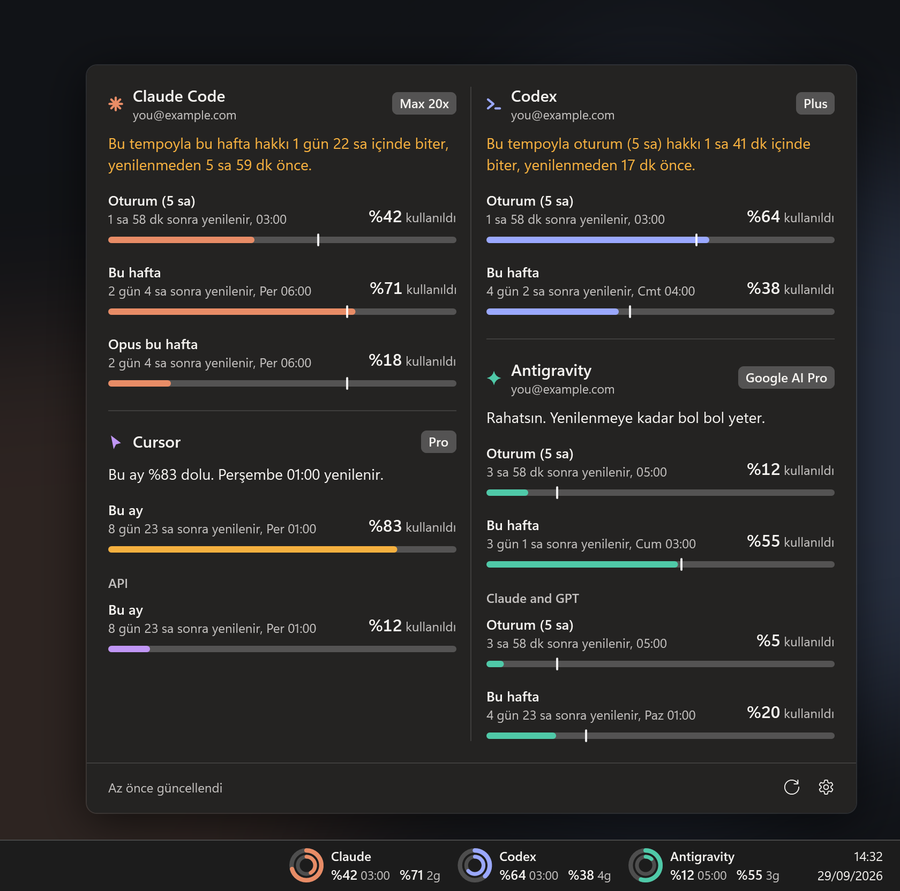

<div align="center">


# TokenTray

**Claude Code, Codex, Gemini (Antigravity), Cursor, Grok ve OpenCode kullanım limitleri — Windows görev çubuğunda, canlı.**

5 saatlik oturum ve haftalık limitlerini saatin yanında gör, ne zaman yenileneceklerini tam olarak bil,
bitmeden haberin olsun. Tarayıcı sekmesi yok, `/usage` komutu yok, telemetri yok.

[](#kurulum)
[](https://dotnet.microsoft.com/)
[](https://github.com/emrecengdev/tokentray/releases/latest)
[](LICENSE)

[**İndir**](https://github.com/emrecengdev/tokentray/releases/latest) · [Özellikler](#özellikler) · [Desteklenen araçlar](#desteklenen-araçlar) · [SSS](#sss) · [English](README.md)



</div>

## Neden TokenTray?

AI kodlama planları kullanımını pencerelerle ölçer: 5 saatlik bir oturum, haftalık bir hak, bazen aylık bir havuz.
Birine işin ortasında takılmak, öğrenmek için en kötü an. TokenTray bütün limitlerini göz önünde tutar,
her birinin ne zaman dolacağını söyler ve temponu değiştirecek vaktin varken seni uyarır.

<div align="center">

</div>

## Özellikler

- **Görev çubuğunda yaşar.** Saatin yanındaki widget her aracın oturum ve haftalık kullanımını gösterir. Her sayının yanında yenilenme zamanı yazar: bugünse `04:00`, günler sonraysa `3g`.
- **Her araç için tek cümle.** Panel sayıların ne anlama geldiğini söyler: *"Rahatsın"*, *"%87 dolu ama bu tempo 04:00'e kadar yetiyor"*, *"Bu tempoyla bu hafta 6 saatte biter, yenilenmeden 2 saat önce"*.
- **Tempo çentiği.** Her çubukta pencerenin ne kadarının geçtiğini gösteren bir çentik var. Onun gerisinde kalırsan yenilenmeye yetişirsin.
- **Beş widget stili, her biri iki varyantlı.** Halka, Nokta, Hücre, Çubuk ve Sade; araç adıyla ya da kompakt ikonla. Ne gösterileceğini sen seçersin: oturum, haftalık, yenilenme zamanı.
- **Üzerine gel, detayı gör.** Kısa bir kart her pencereyi tam yenilenme saatiyle listeler.
- **Rahatsız etmeyen uyarılar.** %20 ve %5 kalınca ve limit yenilenince bildirim; her döngüde bir kez.
- **Birden fazla hesap.** Başka bir Claude Code ya da Codex ayar klasörü ekle; her hesabın sayıları ayrı kalır.
- **Açık, koyu ya da Windows'u izle.** Windows 11'de acrylic panel, Windows 10'da düz. Türkçe ve İngilizce.
- **Özenli davranır.** Son okumayı yeniden başlatmada hatırlar, sayıları silmek yerine eskiyse soluk gösterir, her `Retry-After`'a uyar, görev çubuğu kalabalıklaşınca kenara çekilir.

<div align="center">

</div>

## Desteklenen araçlar

| Araç | Ne görürsün | Nereden okur (salt okunur) |
| --- | --- | --- |
| **Claude Code** (Pro, Max 5x, Max 20x) | 5 saatlik oturum, haftalık, model bazlı haftalık (örn. Opus) | Claude Code CLI girişi (`~/.claude/.credentials.json`) ya da CLI'ınki dolmuşsa Claude masaüstü uygulamasının kendi girişi — yalnız aynı hesapsa |
| **Codex** (ChatGPT Plus, Pro) | 5 saatlik oturum (planında varsa), haftalık | Codex CLI girişi (`~/.codex/auth.json`, `CODEX_HOME`) |
| **Google Antigravity** (Gemini) | Gemini modelleri için 5 saatlik ve haftalık, ayrıca Claude ve GPT havuzu | Windows Kimlik Yöneticisi'ndeki Antigravity girişi |
| **Grok Build** | Haftalık ya da aylık kredi havuzu | Grok CLI girişi (`~/.grok/auth.json`) |
| **Cursor** | Bu fatura ayındaki dahil kullanım, API kullanımı | Cursor'ın yerel oturumu (`state.vscdb`) ya da `CURSOR_SESSION_TOKEN` |
| **OpenCode Go** | 5 saatlik, haftalık, aylık | Senin verdiğin workspace id ve oturum çerezi |

Bilgisayarında bulunan araçlar kendiliğinden açılır. Diğerleri **Ayarlar → Genel**'den açılabilir.

## Kurulum

1. [Son sürümden](https://github.com/emrecengdev/tokentray/releases/latest) bilgisayarına uygun zip'i indir:
   - `TokenTray-…-win-x64.zip`: çoğu bilgisayar için. Tek dosya, başka kurulum yok.
   - `TokenTray-…-win-arm64.zip`: Snapdragon ve diğer ARM dizüstüler için.
   - `TokenTray-…-win-x64-small.zip`: 6 MB, [.NET 10 Desktop Runtime](https://dotnet.microsoft.com/download/dotnet/10.0) ister.
2. İstediğin yere çıkar ve `TokenTray.exe`'yi çalıştır. Panel bir kez açılıp ne bulduğunu gösterir.
3. İstersen: **Ayarlar → Genel → Windows ile başlat**.

> Exe henüz kod imzalı değil, bu yüzden Windows SmartScreen ilk seferde uyarabilir: **Ek bilgi → Yine de çalıştır**'ı seç. Her sürümde `SHA256SUMS.txt` özetleri var.

**Gereksinimler:** Windows 10 1809 ya da sonrası veya Windows 11 (x64 ya da ARM64) ve yukarıdaki araçlardan birinde açık bir oturum.

## Kullanım

| Şunu yap | Şunun için |
| --- | --- |
| Widget'ın üzerine gel | Her pencereyi tam yenilenme saatiyle gör |
| Widget'a ya da tepsi simgesine tıkla | Paneli aç |
| Sağ tıkla | Şimdi yenile, Ayarlar, Çık |
| Ayarlar → Görev çubuğu | Stil ve varyant seç, widget'ta ne görüneceğini belirle, konumunu ayarla |
| Ayarlar → Genel | Araçları aç/kapat, hesap ekle, *kullanılan* ya da *kalan* göster, tema, bildirimler, kontrol sıklığı |

Windows 11 tepsi simgesini `^` altına saklarsa görev çubuğuna sürükleyip sabitle.

## Gizlilik ve güvenlik

- **Salt okunur.** TokenTray token'ları asla yenilemez, hiçbir aracın dosyasına yazmaz. Oturum dolarsa aracı bir kez aç, kendisi yeniler.
- **Doğrudan kaynağa.** İstekler yalnızca her aracın kendi kullanım uç noktasına gider. TokenTray sunucusu yok.
- **Telemetri yok.** Bu istekler dışında senin ya da kullanımınla ilgili hiçbir şey bilgisayarından çıkmaz.
- **Yerel kayıtlar:** ayarlar `%APPDATA%\TokenTray`, son okuma ve bildirim geçmişi `%LOCALAPPDATA%\TokenTray` altında. İstediğin zaman silebilirsin.
- Claude masaüstü uygulamasının girişi senin Windows kullanıcına şifrelidir. TokenTray onu uygulamanın kendisi gibi Windows DPAPI ile çözer ve yalnız CLI'ın hesabıyla eşleşiyorsa kullanır.

Bir güvenlik açığı mı buldun? [SECURITY.md](SECURITY.md)'ye bak.

## SSS

<details>
<summary><b>Claude Code kullanım limitimi Windows'ta nasıl görürüm?</b></summary>

Claude Code'a (`claude`) ya da Claude masaüstü uygulamasına giriş yap, sonra TokenTray'i çalıştır. 5 saatlik oturum ve haftalık limitlerin saatin yanında görünür; Claude'un *Ayarlar → Kullanım* sayfasındaki sayıların aynısı.
</details>

<details>
<summary><b>Codex'in 5 saatlik limitini gösteriyor mu?</b></summary>

Evet, ChatGPT planında varsa. TokenTray Codex servisinin hesabın için bildirdiği pencereleri aynen gösterir; yalnız haftalık limit varsa yalnız onu gösterir, boş yer tutucu koymaz.
</details>

<details>
<summary><b>"Oturum doldu" yazıyor. Ne yapmalıyım?</b></summary>

Aracı bir kez aç: `claude`, `codex` ya da `grok` çalıştır veya Antigravity'yi ya da Cursor'ı aç. Araç kendi oturumunu yeniler. O zamana kadar TokenTray son okumayı soluk renkte göstermeye devam eder.
</details>

<details>
<summary><b>En kısa kontrol aralığı neden iki dakika?</b></summary>

Claude'un kullanım uç noktası sık isteklere *429 Too Many Requests* ile cevap veriyor. İki dakika bu sınırın rahatça içinde kalır. TokenTray her `Retry-After` süresine, yeniden başlatmada ve elle yenilemede bile uyar.
</details>

<details>
<summary><b>Kullanılan yerine kalanı gösterebilir miyim?</b></summary>

Evet: **Ayarlar → Genel → Sayılar neyi göstersin → Kalan**. Varsayılan, Claude ve Codex'in kendi gösterimine uygun olarak *Kullanılan*.
</details>

<details>
<summary><b>Dikey ya da otomatik gizlenen görev çubuğunda, birden fazla monitörde çalışır mı?</b></summary>

Widget ana monitördeki yatay görev çubuğunda durur ve otomatik gizlenmeyi izler. Görev çubuğu dikeyse tepsi simgesi ve panel yine çalışır.
</details>

<details>
<summary><b>Anthropic, OpenAI, Google, xAI ya da Cursor mı yaptı?</b></summary>

Hayır. TokenTray bağımsız bir açık kaynak projedir; hiçbiriyle bağlantılı değildir ve hiçbiri tarafından onaylanmamıştır. Resmi araçların sana gösterdiği kullanım bilgisinin aynısını okur.
</details>

## Kaynaktan derleme

```powershell
git clone https://github.com/emrecengdev/tokentray
cd tokentray
dotnet test                          # 50 birim testi
dotnet run --project src/TokenTray   # çalıştır
.\publish.ps1 -Version 1.1.0         # sürüm zip'leri + SHA256SUMS, .\dist altında
```

[.NET 10 SDK](https://dotnet.microsoft.com/download/dotnet/10.0) gerekir. README görselleri örnek verilerle uygulamanın kendisi tarafından çizilir: `TokenTray.exe --render-media docs\media --lang tr`, ardından `python tools\make_hero.py docs\media\tr`.

## Katkı

Hata bildirimleri ve pull request'ler memnuniyetle karşılanır; özellikle bizim test edemediğimiz araç, plan ve Windows kurulumlarından gelen raporlar. [CONTRIBUTING.md](CONTRIBUTING.md)'ye bak.

## Lisans

[MIT](LICENSE). Ürün adları ve markalar sahiplerine aittir; TokenTray'deki araç simgeleri logoları değil, basit geometrik işaretlerdir.

Esin kaynağı: [CodeZeno/Claude-Code-Usage-Monitor](https://github.com/CodeZeno/Claude-Code-Usage-Monitor).
