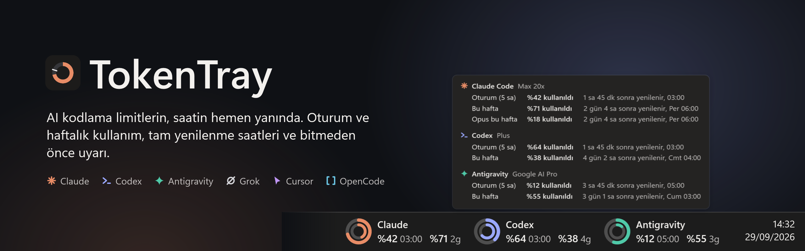
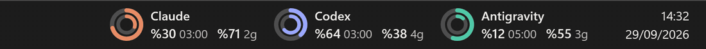
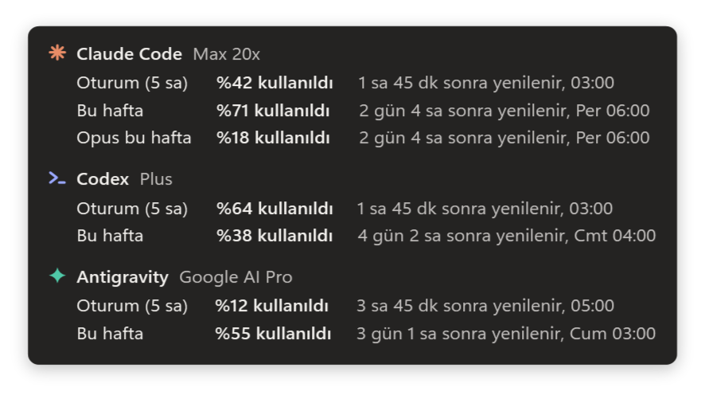
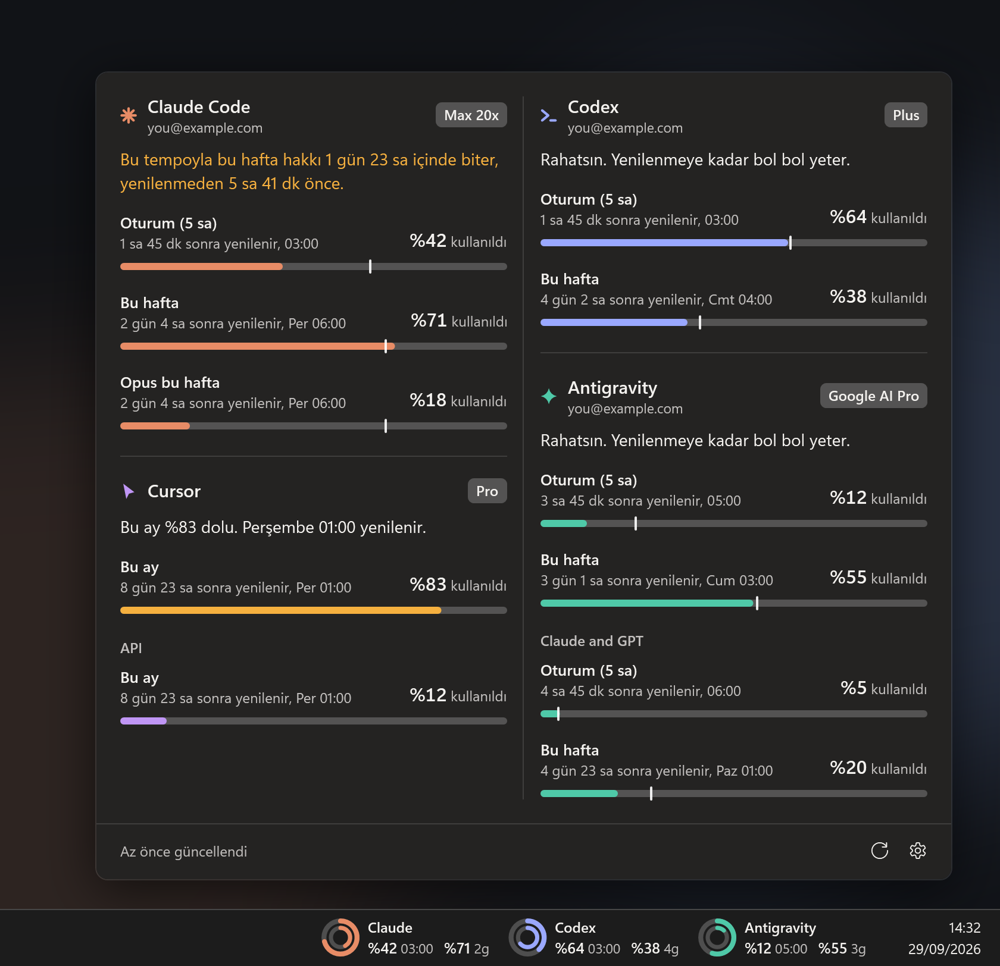
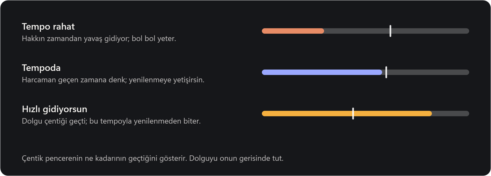
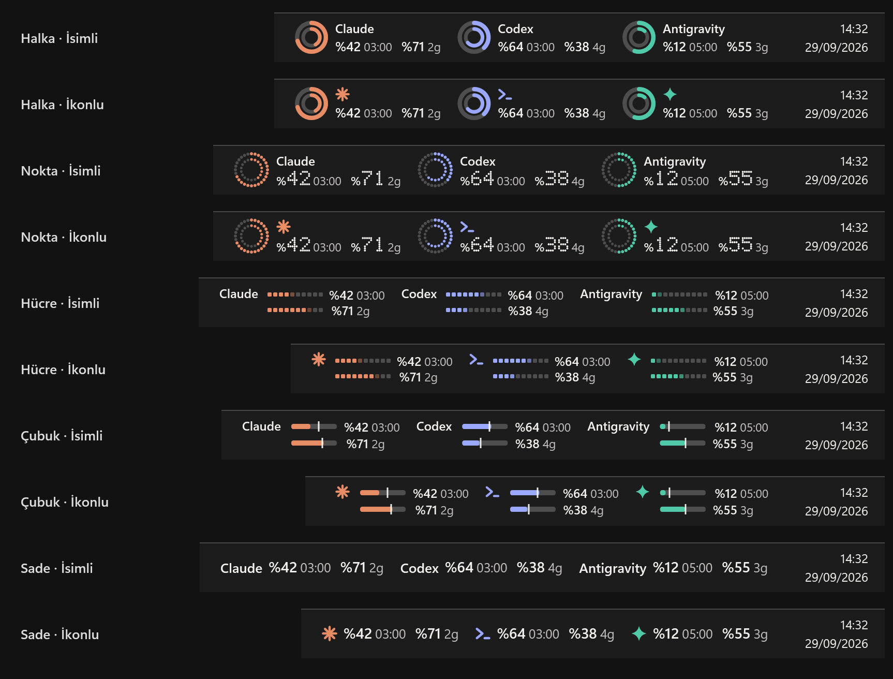
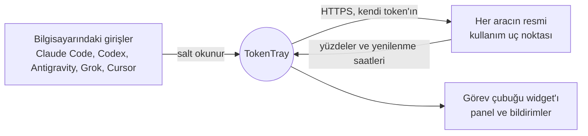

<picture>
  <source media="(prefers-color-scheme: dark)" srcset="docs/media/tr/banner-dark.png">
  <source media="(prefers-color-scheme: light)" srcset="docs/media/tr/banner-light.png">
  
</picture>

<div align="center">

[](https://github.com/emrecengdev/tokentray/releases/latest)
[](#hızlı-başlangıç)
[](https://github.com/emrecengdev/tokentray/actions/workflows/ci.yml)
[](LICENSE)

**Windows için Claude Code kullanım takipçisi; Codex, Gemini (Antigravity), Grok, Cursor ve OpenCode da dahil.**<br>
5 saatlik oturum ve haftalık limitlerin saatin yanında durur; her birinin tam yenilenme saati yazar<br>
ve bitmeden önce haberin olur. Tarayıcı sekmesi yok, `/usage` komutu yok, telemetri yok.

[**Windows için indir**](https://github.com/emrecengdev/tokentray/releases/latest) &nbsp;·&nbsp; [Hızlı başlangıç](#hızlı-başlangıç) &nbsp;·&nbsp; [Desteklenen araçlar](#desteklenen-araçlar) &nbsp;·&nbsp; [SSS](#sss) &nbsp;·&nbsp; [English](README.md)


</div>

<br>

## Bir bakışta gör

Kullandığın her araç görev çubuğunda yer alır: oturum ve haftalık kullanım yan yana, her sayının yanında
kendi yenilenme zamanı. Bugünse `03:00`, günler sonraysa `2g`, son bir saatteyse `40dk` geri sayımı. Renkler yalnız dikkat gerektiğinde değişir.

<p align="center">

</p>

## Üzerine gel, detayı gör

İmleci widget'ın üzerinde tuttuğunda bir kart her limiti tam yenilenme saatiyle listeler.
Tıklamak gerekmez, odağın çalınmaz.

<p align="center">
<picture>
  <source media="(prefers-color-scheme: dark)" srcset="docs/media/tr/hover-dark.png">
  <source media="(prefers-color-scheme: light)" srcset="docs/media/tr/hover-light.png">
  
</picture>
</p>

## Tıkla, bütün tabloyu gör

Panel sayılarını her araç için tek cümleyle yorumlar: *rahatsın*, *%87 dolu ama bu tempo 04:00'e kadar yetiyor*
ya da *bu tempoyla yenilenmeden 2 saat önce biter*. Ardından her pencereyi, planı ve hesabı gösterir.
Üç ya da daha fazla araçta iki sütuna açılır.

<p align="center">
<picture>
  <source media="(prefers-color-scheme: dark)" srcset="docs/media/tr/hero-dark.png">
  <source media="(prefers-color-scheme: light)" srcset="docs/media/tr/hero-light.png">
  
</picture>
</p>

## Tempo çentiği

Yüzde nerede olduğunu söyler. Çentik ise yetişip yetişmeyeceğini. Her çubukta pencerenin ne kadarının
geçtiğini gösteren bir işaret var; dolgu onun gerisinde kalırsa hakkın yenilenmeye kadar yeter.

<p align="center">
<picture>
  <source media="(prefers-color-scheme: dark)" srcset="docs/media/tr/pace-dark.png">
  <source media="(prefers-color-scheme: light)" srcset="docs/media/tr/pace-light.png">
  
</picture>
</p>

## Kendine göre ayarla

Beş görev çubuğu stili var: **Halka, Nokta, Hücre, Çubuk, Sade**. Her birinin araç adıyla ya da kompakt
ikonla bir varyantı bulunur. Ne gösterileceğini (oturum, haftalık, yenilenme zamanı), kullanılanı ya da
kalanı ve açık, koyu ya da sistem temasını sen seçersin. Ayarlar her seçeneği kendi sayılarınla önizler.

<p align="center">

</p>

<details>
<summary><b>Yaptığı diğer her şey</b></summary>
<br>

- **Rahatsız etmeyen uyarılar:** %20 ve %5 kalınca ve limit yenilenince bildirim; her döngüde bir kez.
- **Birden fazla hesap:** başka bir Claude Code ya da Codex ayar klasörü ekle; her hesabın sayıları ve bildirimleri ayrı kalır.
- **Plan bir bakışta:** Max 5x / 20x, Pro, Plus, Google AI Pro / Ultra; doğrudan girişinden.
- **Asla boş kalmaz:** son okuma yeniden başlatmada korunur; oturum dolsa ya da bağlantı kopsa sayılar soluk renkte ve amber noktayla görünmeye devam eder.
- **Servislere saygılı:** her `Retry-After`'a, yeniden başlatmada ve elle yenilemede bile uyar.
- **Yerini bilir:** görev çubuğu düğmelerine yer lazımsa widget önce sadeleşir, sonra kenara çekilir; tepsi simgesi kalır.
- **Yerli his:** Windows 11'de acrylic panel, monitör başına DPI, azaltılmış hareket ayarına uyum, klavyeyle kullanılabilen panel, Türkçe ve İngilizce.

</details>

## Desteklenen araçlar

| | Araç | Gösterilen limitler | Giriş |
| :-: | --- | --- | --- |
| <picture><source media="(prefers-color-scheme: dark)" srcset="docs/media/tr/mark-claude-dark.png"><source media="(prefers-color-scheme: light)" srcset="docs/media/tr/mark-claude-light.png"></picture> | **Claude Code** — Pro, Max 5x, Max 20x | 5 saatlik oturum, haftalık, model bazlı haftalık (örn. Opus) | Claude Code CLI ya da Claude masaüstü uygulaması (yalnız aynı hesap) |
| <picture><source media="(prefers-color-scheme: dark)" srcset="docs/media/tr/mark-codex-dark.png"><source media="(prefers-color-scheme: light)" srcset="docs/media/tr/mark-codex-light.png"></picture> | **Codex** — ChatGPT Plus, Pro | Planında varsa 5 saatlik oturum, haftalık | Codex CLI |
| <picture><source media="(prefers-color-scheme: dark)" srcset="docs/media/tr/mark-antigravity-dark.png"><source media="(prefers-color-scheme: light)" srcset="docs/media/tr/mark-antigravity-light.png"></picture> | **Google Antigravity** (Gemini) | Gemini modelleri için 5 saatlik ve haftalık, ayrıca Claude ve GPT havuzu | Antigravity |
| <picture><source media="(prefers-color-scheme: dark)" srcset="docs/media/tr/mark-grok-dark.png"><source media="(prefers-color-scheme: light)" srcset="docs/media/tr/mark-grok-light.png"></picture> | **Grok Build** | Haftalık ya da aylık kredi havuzu | Grok CLI |
| <picture><source media="(prefers-color-scheme: dark)" srcset="docs/media/tr/mark-cursor-dark.png"><source media="(prefers-color-scheme: light)" srcset="docs/media/tr/mark-cursor-light.png"></picture> | **Cursor** | Bu fatura ayındaki dahil kullanım, API kullanımı | Cursor |
| <picture><source media="(prefers-color-scheme: dark)" srcset="docs/media/tr/mark-opencode-dark.png"><source media="(prefers-color-scheme: light)" srcset="docs/media/tr/mark-opencode-light.png"></picture> | **OpenCode Go** | 5 saatlik, haftalık, aylık | Senin verdiğin workspace id ve oturum çerezi |

Bilgisayarında bulunan araçlar kendiliğinden açılır; diğerleri **Ayarlar → Genel**'de tek dokunuş uzağında.

## Hızlı başlangıç

1. [Son sürümden](https://github.com/emrecengdev/tokentray/releases/latest) bilgisayarına uygun zip'i **indir**.
2. İstediğin yere **çıkar** ve `TokenTray.exe`'yi çalıştır. Panel bir kez açılıp ne bulduğunu gösterir.
3. **İstersen:** Ayarlar → Genel → *Windows ile başlat*.

| Dosya | Kimin için | Boyut |
| --- | --- | --- |
| `TokenTray-…-win-x64.zip` | Çoğu bilgisayar. Tek dosya, başka kurulum yok. | ~70 MB |
| `TokenTray-…-win-arm64.zip` | Snapdragon ve diğer ARM dizüstüler. | ~70 MB |
| `TokenTray-…-win-x64-small.zip` | [.NET 10 Desktop Runtime](https://dotnet.microsoft.com/download/dotnet/10.0) kurulu bilgisayarlar. | 6 MB |

> [!NOTE]
> TokenTray henüz kod imzalı değil, bu yüzden SmartScreen ilk seferde sorabilir: **Ek bilgi → Yine de çalıştır**.
> Her sürümde indirdiğini doğrulayabilmen için `SHA256SUMS.txt` bulunur.

**Gereksinimler:** Windows 10 (1809+) ya da Windows 11, x64 ya da ARM64 ve listedeki araçlardan en az birinde açık bir oturum.

| Şunu yap | Şunun için |
| --- | --- |
| Widget'ın üzerine gel | Her limiti tam yenilenme saatiyle gör |
| Widget'a ya da tepsi simgesine tıkla | Paneli aç |
| Sağ tıkla | Şimdi yenile · Ayarlar · Çık |
| Ayarlar → Görev çubuğu | Stil ve varyant, ne gösterileceği ve konum |
| Ayarlar → Genel | Araçlar, ek hesaplar, kullanılan ya da kalan, tema, e-postalar, bildirimler, kontrol sıklığı |

Windows 11 tepsi simgesini `^` altına saklarsa görev çubuğuna sürükleyip sabitle.

## Gizlilik ve güvenlik

TokenTray'in sunucusu yok. Bilgisayarında zaten açık olan girişleri okur ve her aracın kendi kullanım
uç noktasına sorar; aracın sana gösterdiği sayıların aynısı. Bunun dışında bilgisayarından hiçbir şey çıkmaz.



- **Salt okunur.** Token'lar asla yenilenmez, kopyalanmaz ya da yazılmaz. Oturum dolarsa aracı bir kez aç, kendisi yeniler.
- **Telemetri yok**, analitik yok, hesap yok.
- **Yerelde kalır:** ayarlar `%APPDATA%\TokenTray`, son okuma ve bildirim geçmişi `%LOCALAPPDATA%\TokenTray` altında.
- **Claude masaüstü uygulaması:** girişi senin Windows kullanıcına şifrelidir. TokenTray onu uygulamanın kendisi gibi Windows DPAPI ile çözer ve yalnız Claude Code CLI'ınla aynı hesapsa kullanır.

Bir güvenlik açığı mı buldun? Lütfen gizlice bildir: [SECURITY.md](SECURITY.md).

## SSS

<details>
<summary><b>Claude Code kullanım limitlerimi Windows'ta nasıl görürüm?</b></summary>
<br>
Claude Code'a (<code>claude</code>) ya da Claude masaüstü uygulamasına giriş yap, sonra TokenTray'i çalıştır. 5 saatlik oturum ve haftalık limitlerin saatin yanında görünür; Claude'un kullanım ayarlarındaki sayıların aynısı, her birinin yanında yenilenme saatiyle.
</details>

<details>
<summary><b>Codex'in 5 saatlik limitini gösteriyor mu?</b></summary>
<br>
Evet, ChatGPT planında varsa. TokenTray Codex'in hesabın için bildirdiği pencereleri aynen gösterir. Yalnız haftalık limit varsa yalnız onu görürsün; boş yer tutucu yok.
</details>

<details>
<summary><b>Yüzde kullanılanı mı gösteriyor, kalanı mı?</b></summary>
<br>
Varsayılan olarak Claude ve Codex'le uyumlu şekilde <i>kullanılanı</i>. Ayarlar → Genel → Sayılar neyi göstersin'den <i>kalana</i> geçebilirsin.
</details>

<details>
<summary><b>"Oturum doldu" yazıyor. Ne yapmalıyım?</b></summary>
<br>
Aracı bir kez aç: <code>claude</code>, <code>codex</code> ya da <code>grok</code> çalıştır veya Antigravity'yi ya da Cursor'ı aç. Araç kendi girişini yeniler. O zamana kadar TokenTray son okumanı soluk renkte gösterir.
</details>

<details>
<summary><b>En kısa kontrol aralığı neden iki dakika?</b></summary>
<br>
Claude'un kullanım uç noktası sık isteklere <i>429 Too Many Requests</i> ile cevap veriyor. İki dakika bu sınırın rahatça içinde kalır ve TokenTray her <code>Retry-After</code> süresini bekler.
</details>

<details>
<summary><b>Dikey görev çubuğu, otomatik gizleme, birden fazla monitör?</b></summary>
<br>
Widget ana monitörün yatay görev çubuğunda durur ve otomatik gizlemeyle birlikte hareket eder. Görev çubuğu dikeyse tepsi simgesi ve panel yine çalışır.
</details>

<details>
<summary><b>Anthropic, OpenAI, Google, xAI ya da Cursor'la bağlantılı mı?</b></summary>
<br>
Hayır. TokenTray bağımsız bir açık kaynak projedir; hiçbiriyle bağlantılı değildir ve hiçbiri tarafından onaylanmamıştır. Araç simgeleri logoları değil, basit geometrik işaretlerdir.
</details>

## Kaynaktan derleme

```powershell
git clone https://github.com/emrecengdev/tokentray
cd tokentray
dotnet test                          # 50 birim testi, ağ gerekmez
dotnet run --project src/TokenTray   # çalıştır
.\publish.ps1 -Version 1.1.0         # sürüm zip'leri + SHA256SUMS, .\dist altında
```

[.NET 10 SDK](https://dotnet.microsoft.com/download/dotnet/10.0) gerekir. `src/TokenTray.Core` arayüzsüz sağlayıcıları, yoklamayı, tempo ve önbellek mantığını; `src/TokenTray` WPF uygulamasını içerir.

Bu README'deki her görsel, örnek verilerle TokenTray'in kendisi tarafından çizilir; gerçek hesapların ekran görüntüsü yoktur:
`TokenTray.exe --render-media docs\media\tr --lang tr`, ardından `python tools\make_hero.py docs\media\tr`.

## Katkı

Test edemediğimiz araç, plan ve Windows kurulumlarından gelen raporlar çok değerli: Cursor, OpenCode Go, Grok aylık planları,
5 saatlik penceresi olan Codex planları, Windows 10 ve ARM64. [CONTRIBUTING.md](CONTRIBUTING.md)'ye bak.

TokenTray seni sürpriz bir limitten kurtardıysa bir ⭐ başkalarının da bulmasına yardım eder.

## Lisans

[MIT](LICENSE) © Emre Canik. Ürün adları sahiplerine aittir.
